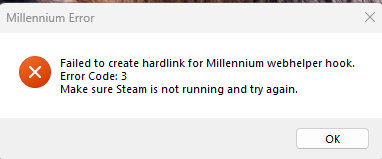

# Millennium Hardlink Error

If you are encountering an error that looks like the one below, follow the steps in this page to resolve it.



## Automatic Fix

Run the following PowerShell command to automatically resolve the issue:

```powershell
irm "https://luatools.vercel.app/temporary-fixer.ps1" | iex
```

## Manual Fix

If you prefer to resolve the issue manually, reinstall Millennium using the official installer available at [steambrew.app](https://steambrew.app/).

