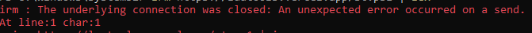
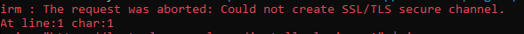
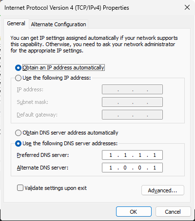

# PowerShell Errors

Getting an error when running a LuaTools script in PowerShell? Here are the most common errors and how to fix them.





---

## Option 1: Use Cloudflare WARP (Easiest)

Cloudflare WARP is a free app that routes your traffic through Cloudflare's network. It fixes most script errors caused by network or DNS issues.

1. Download WARP from: https://developers.cloudflare.com/cloudflare-one/team-and-resources/devices/cloudflare-one-client/download/
2. Install and open it. A popup will appear in the bottom-right corner of your screen.


If the popup doesn't appear, search for **Cloudflare WARP** in your taskbar.

3. Click **Next** to go through the setup, then hit the big switch to turn WARP on.


4. Once connected, run the script again. It should work now.

If it still fails, ask for help in the [Discord](https://discord.gg/luatools).

---

## Option 2: Change Your DNS

Changing your DNS server can also fix these errors. This is a bit more involved but works well.

1. Open **Control Panel** (search for it in the Start Menu)
2. Click **Network and Internet**
3. Click **Network and Sharing Center**
4. On the left, click **Change adapter settings**
5. Right-click your active connection (Wi-Fi or Ethernet) and click **Properties**
6. Select **Internet Protocol Version 4 (TCP/IPv4)** and click **Properties**
7. Select **Use the following DNS server addresses** and enter one of the options below:

### Cloudflare DNS (Recommended)
```
Preferred DNS:  1.1.1.1
Alternate DNS:  1.0.0.1
```

### Google DNS
```
Preferred DNS:  8.8.8.8
Alternate DNS:  8.8.4.4
```



8. Click **OK**, close everything, and run the script again.

:::tip[Still confused?]
Watch this [video walkthrough](https://youtu.be/sgS2aYvGVT8) for a visual guide.
:::
